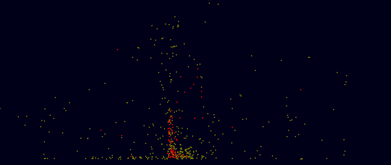
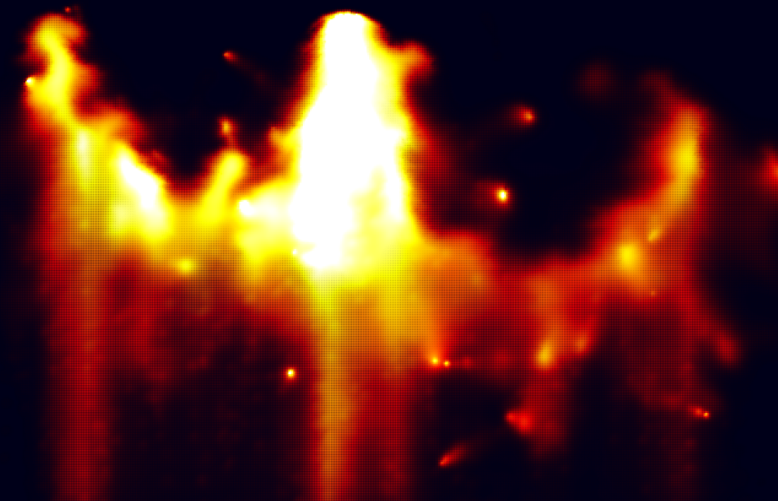
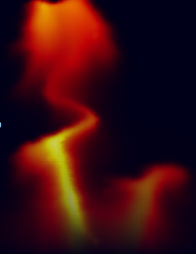

% Animating Explosions with an Incompressible Fluid Model
% CS 184 Final Project Final
% Yujie Wen, Hankun Zhao

<iframe width="600" height="315" src="https://www.youtube.com/embed/slvs6d1cw7w" frameborder="0" allowfullscreen></iframe>

# Abstract

We simulated explosions in 2D using incompressible fluid dynamics, as described in Feldman 2003. A incompressible model should be able to simulate the fireball and particulate effects of an explosion accurately. Our model uses three primary fields: velocity, temperature, and smoke, all governed by the incompressible Navier-Stokes equations. We simplified the particles described in Feldman 2003 to two types: soot, and fuel. Our model considers many interactions, including:

* Interactions between combusting particles and the fluid, temperature, and smoke fields
* Interactions between soot particles and the fluid, temperature, and smoke fields
* Interactions between the temperature field and the fluid field
* Interactions between the smoke field and fluid field

# Technical Approach

## Discretized Fields

For general field updates we followed the method detailed in Stam. Each field was discretized into a 400 by 600 grid. Simulating the fields involved adding external forces/sources, advecting, projecting, and diffusing the fields in accordance with the Navier-Stokes equations. The effects of each step will be detailed later in this writeup.

$$ \dot{u} = -(u \cdot \nabla)u - \frac{\nabla p}{\rho} + \frac{f}{\rho} $$

Navier Stokes. The first term roughly corresponds to self-advection. The second term corresponds to maintaining incompressibility. The third term corresponds to extneral forces.

## Velocity Field

The velocity field. Red-black depicts x direction. Green-black depicts y direction.

We represent the velocity field using a 2D grid structure, where each cell stores the velocity of the fluid in that cell. In a general sense, the Navier Stokes equations states that the components of fluid motion are self-advection, density preservation, and outside forces. For an incompressible model, density is constant, simplifying the solution. 

Advection is performed by performing explicit integration. A cell’s velocity at $t + \Delta t$ is calculated by tracing the fluid in that cell back to where it was at time t. 

Projection is the procedure which preserves density across the cells. This involves computing the Helmholtz decomposition of the field, which converts the flow field to the sum of divergence-free and curl-free fields. For an incompressible fluid, we simply discard the diverging field to maintain incompressibility.

Fundamental external forces in our fluid model include forces from vorticity confinement and thermal buoyancy. Vorticity confinement prevents the fluid field from quickly reaching a static equilibrium by amplifying the curl of the fluid field using the method detailed in Fedkiw. This creates a shimmering motion in the stable fluid and creates vortices in moving fluid.

$\vec{\omega} = \nabla \times \vec{v} = \frac{\delta v_y}{\delta x} - \frac{\delta v_x}{\delta y}$

$f_{vort} = \frac{\epsilon}{|\nabla |\omega ||}(\nabla |\omega| \times \omega)$

Calculating vorticity confinement forces

For an incompressible fluid, we cannot simulate thermal expansion, so we instead simulate thermal buoyancy by applying an upwards force on cells proportional to the vertical temperature gradient across cells as detailed in Foster and Metexas.

$f_{thermal} = \beta \frac{\delta T}{\delta y}$

Calculating thermal buoyancy forces

## Temperature and Smoke Interactions

The temperature and smoke fields are represented using a similar 2D grid structure as the one used for the velocity field. We treated both temperature and smoke as densities and had each cell in the grid store the temperature, for the temperature field, and the smoke density, for the smoke field, at the location of the cell. 

Diffusion for these two fields is implemented by averaging the temperature and smoke density values for each cell with the values in neighboring cells, which causes temperature and smoke to move from cells with higher density to cells with lower density. We then advect the densities in each cell through the velocity field using the same advection procedure as before.

In addition to the approach in Stam’s paper, we also implemented temperature decay for the temperature field which uses Newton’s Law of Cooling to compute the drop in temperature for each time step based on the surrounding temperature. This surrounding temperature is calculated as the average of neighboring temperature values for each cell. Doing so allowed the temperature effects of our explosions to disperse faster, and more realistically.

$\frac{\delta T}{\delta t} = -k (T - T_{ambient})$

Newton's law of cooling

## Particle Model

Particles in an explosion. Brown: fuel. Red: soot.

Our particle model handles two types of particles, fuel and soot. Each particle keeps track of its own location, velocity, radius, and whether or not it is burning. While particle-particle interactions are not modeled, we approximated particle stacking by restricting each cell to only contain 1 particle. For our model, particles are created at an initial radius of 4.

Fuel particles in particular have additional variables that keep track of its burn rate and the temperature at which it ignites. Once ignited, fuel particles release temperature and smoke into the temperature and smoke fields respectively. At the moment of ignition, the flux of the cell at the fuel particle’s location is also increased to simulate an increase in pressure at the moment of combustion. Ignited fuel particles lose volume at a specified burn rate per time step. Soot particles are created by fuel particles at a probability directed related to the fuel particle’s radius. If the radius of the fuel particle is greater than 2, there is a 50% chance of creating a soot particle with each time step, whereas if the fuel particle has a radius less that 0.5, the probability of spawning a soot particle drops to 10%.   

Particle splitting is a phenomenon unique to fuel particles that have been ignited. Regardless of the radius of the particle, fuel particles that have been lit have a 10% chance of splitting into two smaller ignited particles that are each half the size of the original particle with each time step. The newly created particle is spewed out in a random direction with a random force between 0 and 20 to facilitate multiple smaller chain explosions, thereby increasing the explosion radius. We chose to ignore the radius when determining the probability for splitting particles because we observed that a direct relationship between split probability and particle size resulted in explosions that were too compact, since particles would only split in the very beginning. 

Soot particles are simple particles that add to the temperature and smoke fields at the particle’s position for each timestep. These particles represent the physical debris of an explosion.

## Comparison against Feldman 2003

Feldman 2003 used coarse grid discretization with millions of particles. However, such a particle-heavy model would not run in real time, so we chose to simplify their model further by simulating only several hundred particles at a time. While not as physically accurate, our model still produces visually interesting results.

We also also discretize our space into smaller blocks, using >100,000 grid cells on a 2D plane, while Feldman used <1000 grid cells in 3D space. Using a dense grid structure with a sparse particle model lets us parallelize the simulations further and render in real time.

### Benefits of dense-grid, sparse-particle model
* Easily parallelized
* Runs in real-time
* More realistic depiction of atmospheric effects

### Benefits of sparse-grid, dense-particle model
* Simulates 3D space faster than a dense-grid model
* Easier to render in 3D

# Problems Encountered

Boundary conditions were tricker than expected to understand. We ran into several errors with the boundaries, usually when some particle or thermal interactions disrupt the boundary conditions. When this happened, the disrupted boundary cells would inject heat or smoke back into the box, an undesired effect. We fixed this by disabling user input and updates on boundary cells.

We also needed to tune many parameters to ensure that the simulation would revert to a stable condition. The strength of vorticity confinement, thermal effects, and diffusion rates were all carefully adjusted. We wanted to see our explosions propagate quickly through the scene, then quickly disperse.

Keeping a high framerate was important throughout the project. We decreased the number of steps for some of our iterative procedures, sacrificing accuracy for speed. We also found that an interpolating renderer drastically reduced framerates. Whenever possible, routines were parallelized with OpenCL. The interactions between particles and cells prevented us from offloading the grid update computations to highly parallelized shaders.

# Lessons Learned

Discretized methods typically do a subpar job at approximating continuous processes, such as fluid dynamics. While the Navier-Stokes equations are elegantly simple, solving them for a discretized grid over discrete time intervals is a very rough process, requiring many approximations and assumptions. 

The coarseness of discretization places limits on the boundaries of the simulation. We found that, with our chosen grid size and integration procedures, we could not simulate velocities above a certain limit.

Two dimensional simulations are much simpler than three dimensional simulations. There is no good way to visualize a three dimensional field. Adding an additional dimension would also drastically hurt runtime.

# Results

Github: <a href="https://github.com/jerryz123/powder">Link</a>

Presentation slides: <a href="https://docs.google.com/a/berkeley.edu/presentation/d/1lLqTfyZg5VyCVAloRXz1MIzehqq-kvxMobxjMP3VOeU/edit?usp=sharing">Link</a>

(Note: The aliasing in some of these images is an artifact of the screenshot software)

# References

* Feldman, Bryan E., James F. O'brien, and Okan Arikan. "Animating suspended particle explosions." ACM Transactions on Graphics (TOG). Vol. 22. No. 3. ACM, 2003.
* Stam, Jos. "Real-time fluid dynamics for games." Proceedings of the game developer conference. Vol. 18. 2003.
* Fedkiw, Ronald, Jos Stam, and Henrik Wann Jensen. "Visual simulation of smoke." Proceedings of the 28th annual conference on Computer graphics and interactive techniques. ACM, 2001.
* Foster, Nick, and Dimitris Metaxas. "Modeling the motion of a hot, turbulent gas." Proceedings of the 24th annual conference on Computer graphics and interactive techniques. ACM Press/Addison-Wesley Publishing Co., 1997.

# Contributions

## Jackson Wen

* Implemented temperature decay
* Implemented vorticity confinement
* Implemented particle model, and splitting behavior
* Implemented the field simulation pipeline

## Jerry Zhao

* Implemented multiple rendering modes
* Implemented user interface
* Implemented OpenMP multithreading
* Implemented thermal buoyancy, diffusion
* Implemented smoke simulation

